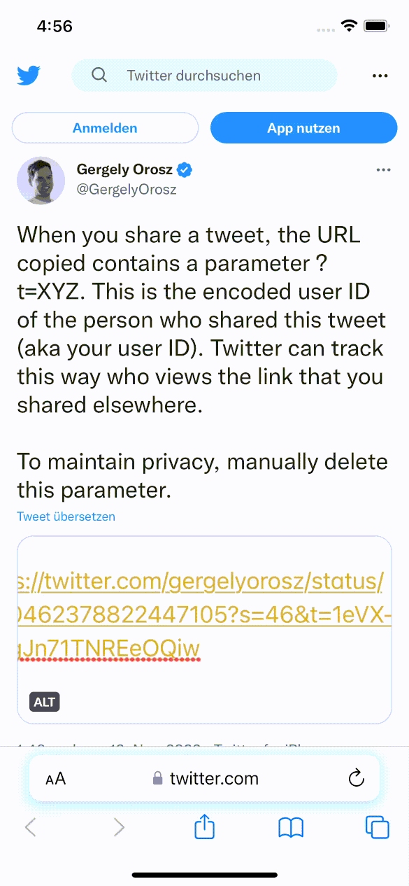
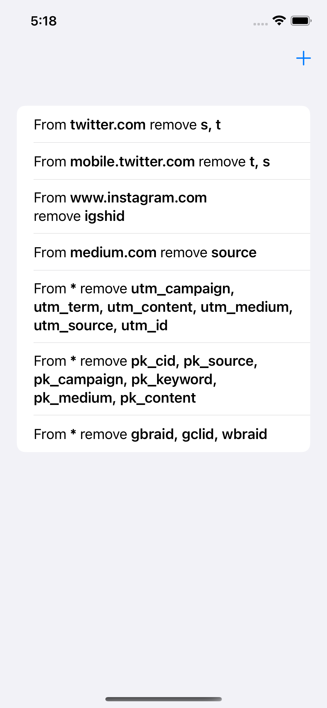
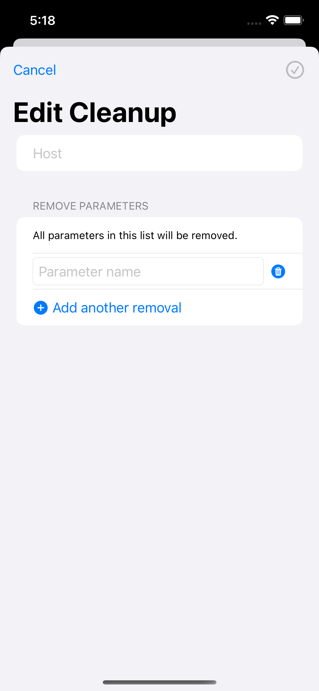

# Share without Tracking

Share without Tracking is an iOS app which removes tracking parameters when you are sharing links.

## How it works

Most apps will add additional tracking parameters to a shared URL when you share via iOS' sharing functionality.

Share without Tracking adds itself as a sharing extension in iOS.

Whenever you use the sharing functionality in iOS, you can select _Share without Tracking_ as a sharing option.
Share without Tracking will then get the shared URL, remove all tracking parameters, and immediately open a sharing dialogue.
In this sharing dialogue you can then share the URL with all tracking parameters removed!

Share without Tracking comes with default configurations for the most common tracking parameters.
However, you can define your own rules for any website and any tracking parameter.

|  |  |
|--------------------------------------|-----------------------------------|

## Feedback, Bugs, and Feature Requests 

I built this app to remove tracking parameters when I share links.
It's for my personal use and fulfills my needs. And I use it to test little things in Swift and SwiftUI.
Nevertheless, I'm more than happy if it's also useful for you. 
Therefore, please submit any feature request or feedback if you see how I can improve the app.
